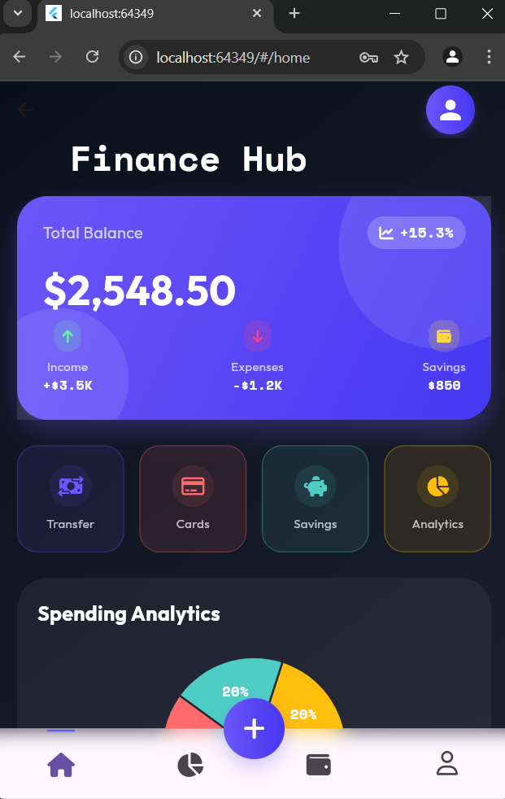
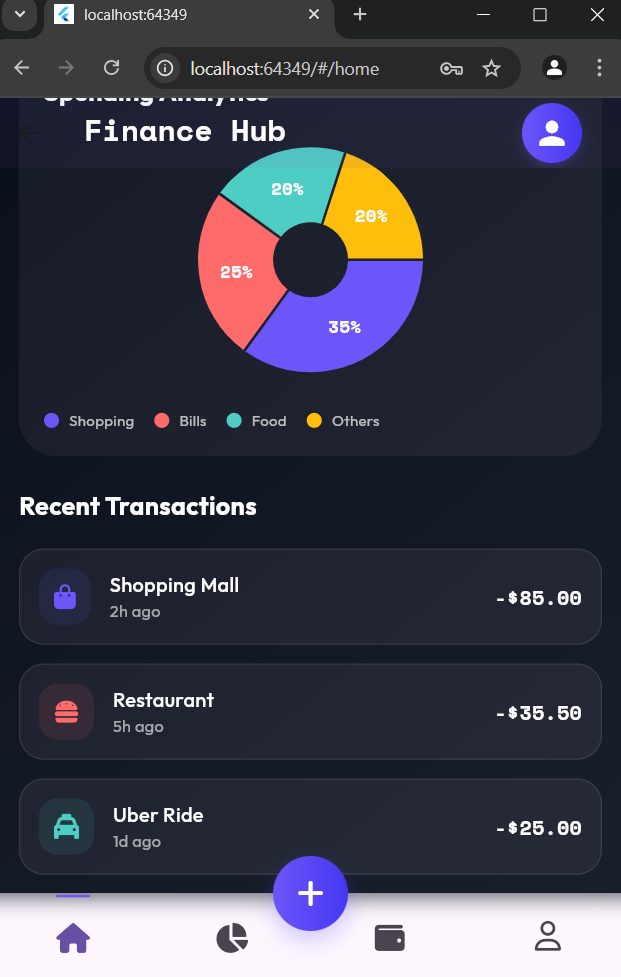
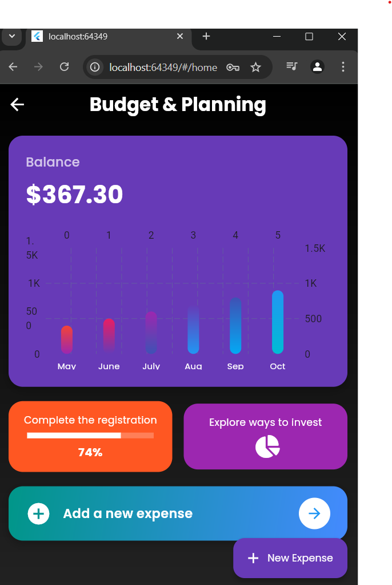
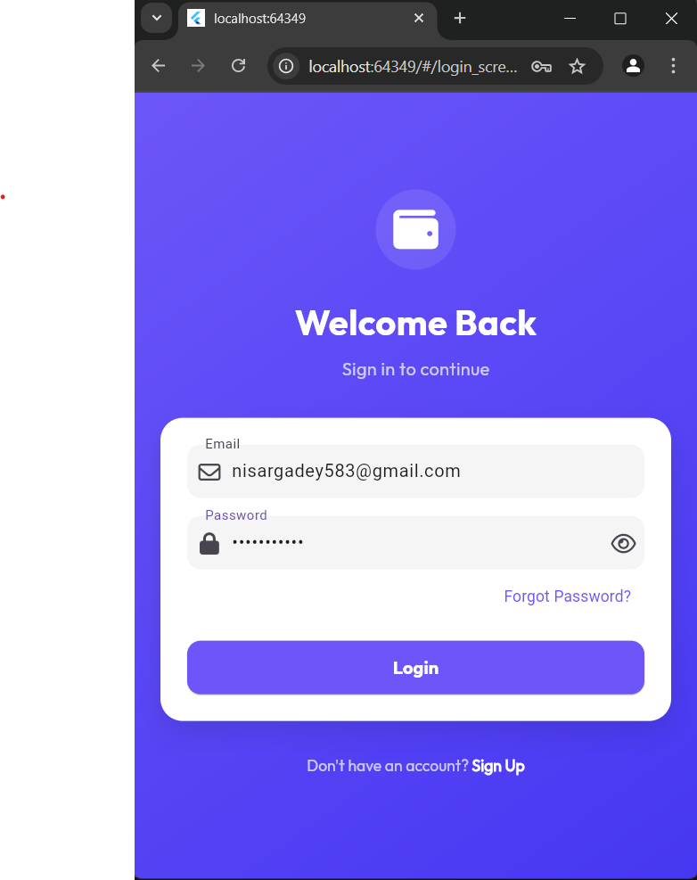
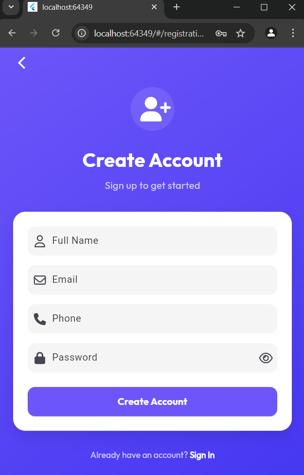

# FinWise: Your Ultimate Financial Companion  
[](https://github.com/[YourUsername]/[RepoName]/blob/main/LICENSE)  
[](https://flutter.dev)  
[](https://firebase.google.com)  

**Take control of your money with intuitive budgeting, bill tracking, and beautiful visualizations.**  
FinWise simplifies personal finance management by turning complex expenses into actionable insights. Track spending, plan budgets, and never miss a subscription payment again!  

---

## ✨ Key Features  
- 📊 **Interactive Visual Reports**: Pie charts, bar graphs, and trend lines to break down your spending habits.  
- 💡 **Smart Budget Planning**: Set monthly budgets for categories (groceries, entertainment) and get alerts when limits are near.  
- 🔔 **Bill & Subscription Tracker**: Never miss a payment! Get reminders for recurring bills (Netflix, utilities, etc.).  
- 📱 **Cross-Platform Sync**: Access your data seamlessly on iOS, Android, and web.  
- 🔒 **Offline-First**: Local data storage ensures your finances are always accessible, even without internet.  

---

## 🛠️ Tech Stack  
- **Frontend**: Flutter (Dart)  
- **Backend**: Firebase (Auth, Firestore, Cloud Functions)  
- **Local Database**: Hive  
- **State Management**: Provider/Riverpod  
- **Charts**: FL Chart/Syncfusion  
- **Testing**: Flutter Test, Mockito  

---

## 📸 Screenshots  
| Dashboard | Expense Tracking | Budget Planner |  
|-----------|------------------|----------------|  
|  |  |  |  

| Profile | Login | Signup |  
|---------------|---------|----------|  
|  |  |  |  

*(Replace `dashboard.png`, `expenses.png`, etc., with your actual screenshot filenames)*  

---

## 🚀 Installation  
1. **Clone the repository**:  
   ```bash  
   git clone https://github.com/[YourUsername]/[RepoName].git  
